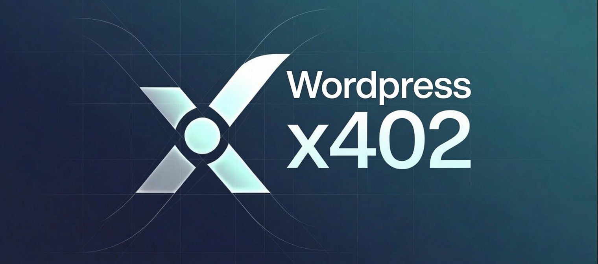

<p align="center">
  <a href="https://x402.inkypyrus.com"></a>
</p>

# x402 for WordPress

**by [realandworks.com](https://realandworks.com)**

Sell files, endpoints, and answers to **AI agents** for USDC, straight from WordPress, over the [x402](https://x402.org) payment protocol. Self-custodial: payments settle on-chain **directly to your wallet** — no account with anyone, no middleman, **0% fees taken by this plugin**.

Sibling projects: [x402-sandbox](https://github.com/RegardV/x402-sandbox) (self-hosted gateway) · [x402-packager](https://github.com/RegardV/x402-packager) (paid retrieval over a markdown corpus).

## How a sale works

```
Agent                        WordPress                        Facilitator
  │ GET /x402/v1/demo            │                                 │
  │◀── 402 + payment-required (base64 challenge, no-store)         │
  │ retry + payment-signature    │                                 │
  │                              ├── POST /verify ────────────────▶│
  │                              ├── POST /settle ────────────────▶│  USDC → your wallet
  │                              ├── ledger (UNIQUE tx_hash)       │
  │◀── 200 + PAYMENT-RESPONSE receipt + content ──                 │
```

No cryptography runs in WordPress and **no private keys ever exist in WordPress** — the facilitator verifies signatures and settles on-chain; the plugin is careful HTTP/JSON.

## Status: Tiers 0–2 complete + Tier 1 (working)

Everything below is settled on-chain against this code by an independent x402 client on Base Sepolia testnet:

- **Paid `/ask` endpoint** — `POST {"query": "..."}`, agents pay per question and get cited passages (excerpt + source + heading + relevance) from your indexed content. SQLite-free: MySQL FULLTEXT with OR-ranked natural-language queries.
- **Corpus import** — upload a zip of markdown (an Obsidian vault, research notes) in wp-admin. Files are sanitized on the way in (dotfiles, binaries, key material rejected; frontmatter stripped), stored privately — never rendered on your site — and sold only as answers.
- **Proxy products** — price any operator-entered upstream URL; buyers pay here, the request is forwarded, the response delivered.
- **wp-admin page** — wallet setting, ask endpoint config, corpus import with accept/reject report, proxy product management, knowledge-index stats, sales ledger.
- **Meta-box products** — tick “Sell to AI agents” on any post, page, or media file, set a price; it’s sold at `/x402/v1/i/{id}`. Browsers get a themed hint page, agents get the raw 402.
- **Mainnet** — separate testnet/mainnet wallet channels + network switch; mainnet settles through the Coinbase CDP facilitator, authenticated by an EdDSA JWT built in pure PHP (key secret encrypted at rest). BYO keys, 0% to us. See [docs/mainnet.md](docs/mainnet.md).
- **Redelivery grace** — a failed download is re-served free within a window (never paid twice); **funnel analytics** — 402-vs-paid conversion on the admin page; **`[x402_catalog]`** shortcode, theme-styled.
- Current wire format (v2, SDK ≥2.18 `payment-signature` with `X-PAYMENT` fallback), CDP description cap, cache hardening (`no-store` + `DONOTCACHEPAGE`), per-ip rate limiting, `UNIQUE(tx_hash)` ledger, secret-scanning sanitizer, clean uninstall.

Roadmap (spec'd): Tier 3 — wordpress.org submission, Bazaar discoverability, demand pricing. WooCommerce bridge and human checkout are deliberate non-goals for the MVP.

## Try it

On any WordPress: install + activate, then open the **x402** menu in wp-admin — set your receive wallet address there, and the page shows your live store endpoints and every settled sale. That's the whole setup.

Or from scratch with the bundled dev stack:

```bash
docker compose -p x402wp up -d
docker exec x402wp-cli-1 wp core install --url=http://localhost:8890 --title=x402dev \
  --admin_user=admin --admin_password=admin --admin_email=dev@example.com --skip-email
docker exec x402wp-cli-1 wp plugin activate x402-for-wordpress
# then set the wallet in wp-admin → x402 (or: wp option update x402_pay_to 0xYourAddress)

curl -sD - "http://localhost:8890/?rest_route=/x402/v1/demo"   # → 402 + challenge
```

Pay it with any x402 client (e.g. the sandbox's `scripts/buy.mjs` with a funded Base Sepolia wallet) and you get the content plus a `PAYMENT-RESPONSE` receipt.

## Tests

```bash
php composer.phar install
./vendor/bin/phpunit        # unit tests against wire fixtures captured from production
```

The protocol classes (`includes/`) are WordPress-free and tested against real captured challenges and signed payments. Conformance testing uses a real paying client against the live testnet facilitator.

## License

GPL-2.0-or-later
